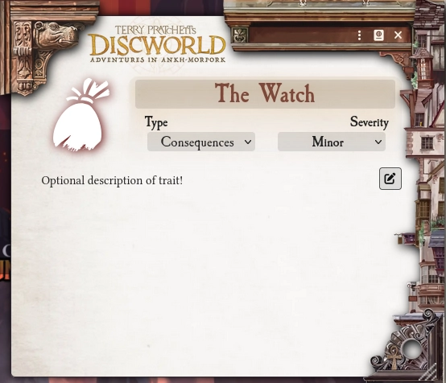
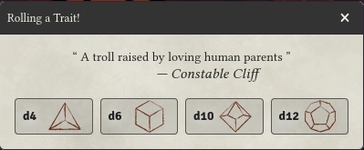
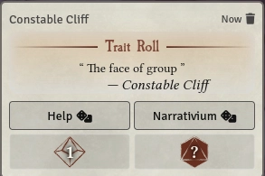

# Terry Pratchett's Discworld - Adventures in Ankh-Morpork by Modiphius

## Character Sheet

The Character Sheet allows you to view, edit, and roll Traits. See the images and legend below for details.

### Normal Mode

### Edit Mode

### Help Mode

### Character Sheet Legend

1. **Name / Pronouns / Luck Panel:**
   - Name (center)
   - Pronouns (bottom-right)
   - Luck (bottom-left)
   - Button to roll Name / Pronouns as a Trait (top-left)
2. **Character Art**
   - Click to change your character's artwork.
3. **Lock/Edit Sheet Button**
   - Click this button to change the sheet from **Normal Mode** to **Edit Mode**, which allows you to adjust the values on the sheet and add/edit/delete Traits.
   - You can also press the `e` key when your sheet is open to toggle between the two modes. This keybind can be changed in Foundry's "Configure Controls" menu.
4. **Traits**
   - Use **Edit Mode** to add/edit/delete Traits on your Character Sheet.
   - Click on a Trait to roll it (see below).
5. **Name/Pronouns/Luck** panel in **Edit Mode**
6. **Buttons - Create Trait**
   - Click to create a new Trait in a particular Category.
   - You can also `double-click` a Trait Category label ("Organization", "Background", etc.) in any mode to create a new Trait in that category.
7. **Buttons - Delete/Edit Trait**
   - Click these buttons to delete or edit a Trait.
   - `Right-click` a Trait while in any mode to Use/Edit/Duplicate/Delete a Trait.
8. **Help Mode Border**
   - A glowing border around the Character Sheet, which indicates the sheet is in **Help Mode**.
9. **Button - Leave Help Mode**
   - Click this button to leave **Help Mode**. This is typically done if you need to exit this mode without rolling.
   - Otherwise, simply roll a Trait while in Help Mode to Help a companion (see below).

## Trait Sheet

Change the Name of the Trait, its Category, its Severity (if Category is "Consequences"), and add an optional Description.

**Note:** It is the Trait's Name which displays on the Character Sheet. To see the Description, simply edit the Trait.

## Roll Trait Dialog

Click on a Trait to open the above dialog. Simply click the appropriate die icon to roll either a d4, d6, d10, or d12.

## Roll Card

Rolling a Trait will produce a roll card to the chat. The roll card displays the Trait's name, the character who rolled, and the results of the roll.

The GM may click the "Narrativium" button to roll their opposed die. The winner of the contest will be highlighted with a green
border.

Depending on the result, another player can Help the character who rolled by clicking the "Help" button. This will open the Character Sheet in **Help Mode**, awaiting a Trait roll. Once rolled, the Help Trait and its result will appear on the original roll card.

Finally, the GM may choose to reroll as well.

## Other Features

- Supports the `Dice So Nice` module.
- Provides default Journal styling to match the system's theme.
- Dark mode support for sheets.

## Up In Smoke (Adventure)

This short adventure serves as both a delightful introduction to the setting of Ankh-Morpork and a guide for the GM and players to learn the rules of the narrative-focused Discworld system:

> The players, a team of Ankh-Morpork's finest Watch members, are called to investigate a robbery at _Lady Ramkin's Sunshine Sanctuary for Sick Dragons_. The mystery will bring the party to and fro across the city; will they be able to crack the case 'ere it grows claws?

